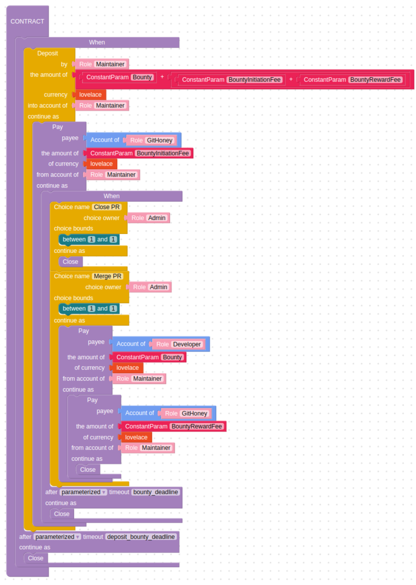

# Github Bounties

&nbsp;
## **Contract / Business Description**

The Bounty contract is a simple financial Marlowe, in which a party (the Maintainer) can make a payment to another party (the Developer) by locking funds in the contract and delegating the responsibility of unlocking the funds to a 3rd party (the Admin).

The Maintainer will first make a deposit into his account. After some external criterion is met, the Admin can unlock the payment, moving the tokens from the Maintainer’s account to the Developer’s account, and closing the contract. After this, the Developer can withdraw their payment.

**ROLES:**

* **Maintainer**: person which opens the issue.
* **Admin**: Bounty Controller backend triggered by github actions / Oracle
* **Developer**: person that opens draft PR for bounty

&nbsp;
## **Bounty Controller API**

### <ins>**createContract**</ins>
Submits a transaction that creates a new Bounty contract. Admin and Developer role tokens are paid to the admin’s address, Maintainer token is paid to the maintainer’s address. Then builds and returns the unsigned Deposit transaction.

**Params**:
* Maintainer address
* Deposit amount (?)
* release bounty deadline
* deposit deadline

**Returns:**
* unsigned deposit tx (needs Maintainer’s signature)
* contractID
* txID ?

&nbsp;
### <ins>**assignDeveloper**</ins>
Submits a transaction that sends the Developer role token from the admin’s address to the specified address.

**Params:**
* contractID
* Developer address

**Returns:**
* txID ?

&nbsp;
### <ins>**unlockPayment**</ins>
Submits a transaction that modifies the contract state and enables the Developer to withdraw their payout.

**Params:**
* contractID

**Returns:**
* txID ?

&nbsp;
### <ins>**withdrawPayment**</ins>
Builds an unsigned transaction for the Developer to withdraw their payouts.

**Params:**
* contractID
* developer address

**Return:**
* unsigned withdraw tx (needs Developer’s signature)
