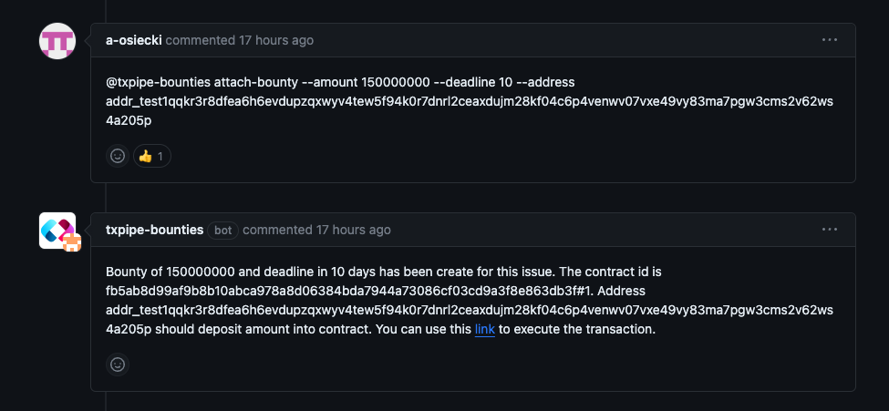
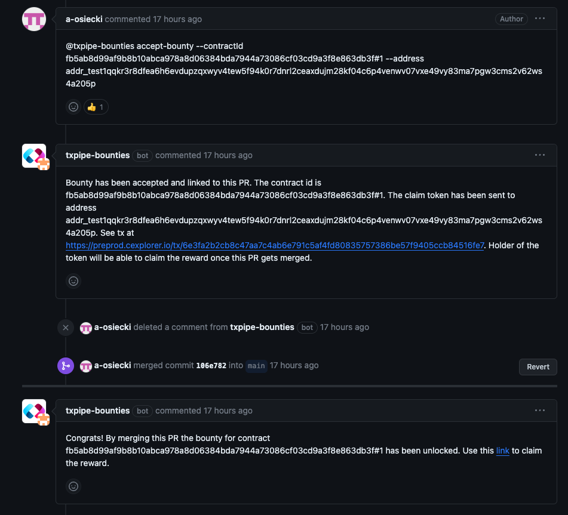

# GitHoney

**GitHoney** is a bounty management system designed specifically for
open-source software development tasks. It's not just any bounty system, it's
one that's built on on-chain smart contracts. This provides visibility and
strong guarantees to all parties involved.

One of the key features of GitHoney is its integration with GitHub. It
operates as a bot within GitHub, interacting with users through issues, PRs, and
comments. This bot is responsible for setting up the on-chain contracts and
monitoring all interactions.

In the GitHoney system, there are three main roles:

- The **maintainer**: This is the individual or team maintaining a GitHub
  repository and has a task that requires completion.
- The **contributor**: This is the individual or team that can complete the task
  by submitting a PR.
- The **bot**: An automated actor that takes care of setting up the on-chain
  contracts and overseeing interactions.

The process is straightforward: a maintainer attaches a bounty to a GitHub
issue. A contributor can then accept this bounty by starting a new PR
referencing the bounty. Once the PR is completed, reviewed, and merged, the
contributor can claim their reward.

Welcome to a streamlined approach to managing your open-source tasks with GitHoney.

## Example interaction

The following screenshot shows an interaction with GitHoney bot using
Github to attach a bounty to an existing issue.

The following screenshot shows an interaction with GitHoney bot using
Github to accept a bounty and merge the ull request.

